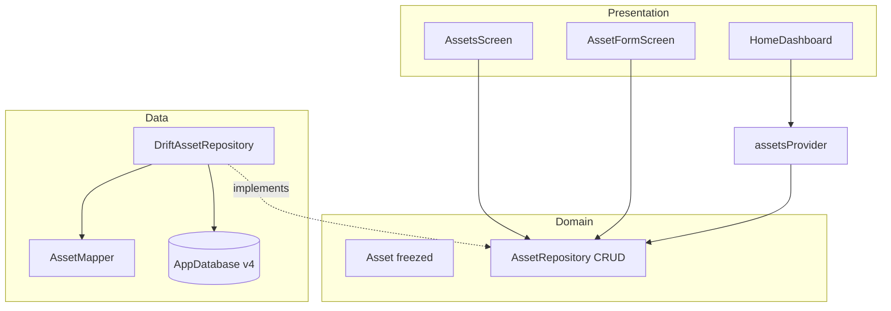

# Assets: UI + CRUD + Drift

Цель этапа — повторить паттерн **Operations** на втором агрегате и довести вкладку Активы до живого списка, а не `ListTile`-заглушки. Ориентир — [`.cursor/app-concept.png`](.cursor/app-concept.png) (экран «Активы»), не пиксель-перфект.

Стек тот же: **freezed + repository + Drift + AsyncNotifier + go_router + l10n + `AppSectionCard`**. Goal/Account остаются mock. `fl_chart` и деталка «Сбербанк» с графиком — не здесь.

Связь с Home: [`homeDashboardProvider`](lib/features/home/presentation/home_providers.dart) уже делает `ref.watch(assetsProvider.future)`. Как только репо станет Drift, капитал и донат на Главной подхватят те же строки **без нового дашборд-кода**.



---

## 1. Что получится в конце

- Активы в SQLite, seed = текущий mock (Газпромнефть, Роснефть, …).
- Вкладка **Активы**: чипы фильтра по `AssetType` + «Все», группировка секций (Акции / Металлы / …), шапка с суммой и взвешенным %.
- Create `/assets/new`, edit `/assets/:id/edit`, удаление с confirm.
- «+» → пункт «Актив».
- Главная пересчитывает капитал/портфель после мутаций (тот же `assetsProvider`).
- Domain/UI не импортируют Drift. Mock с in-memory CRUD остаётся для подмены.

Критерий: полный цикл актива переживает restart; фильтр «Металлы» не в UI-`where` по всему списку, а в запросе репо; Home и Активы показывают одну сумму.

---

## 2. Domain: расширить контракт

Сейчас [`AssetRepository`](lib/domain/repositories/asset_repository.dart) только `getAssets()`. Как у операций:

```dart
abstract class AssetRepository {
  Future<List<Asset>> getAssets({AssetType? type});
  Future<Asset?> getAsset(String id);
  Future<Asset> createAsset(NewAsset asset);
  Future<Asset> updateAsset(Asset asset);
  Future<void> deleteAsset(String id);
}
```

Сущность [`Asset`](lib/domain/entities/asset.dart) — поля как есть (`id`, `name`, `type`, `value`, `changePercent`). Добавить `NewAsset` без `id` (как `NewOperation`).

`changePercent` на этом этапе **вводится вручную** (или 0 по умолчанию). Котировки/API — не здесь. Взвешенный % списка: `Σ (value * changePercent) / sum(value)` в presentation/provider, не хранить отдельной колонкой «итог».

**Учёба:** фильтр `type` в репозитории, не `assets.where` в виджете — иначе позже «Все/Металлы» на больших данных разъедется с SQL. Альтернатива — грузить всё и группировать в UI (проще, хуже урок после Operations, где фильтр уже в Drift).

`assetId` у операций по-прежнему nullable string **без FK**. Join и каскад удаления — мини-задание после этапа.

---

## 3. Data: таблица + миграция v4

Новые файлы по образцу операций:

- [`lib/data/local/tables/assets_table.dart`](lib/data/local/tables/assets_table.dart)
- [`lib/data/mappers/asset_mapper.dart`](lib/data/mappers/asset_mapper.dart)
- [`lib/data/repositories/drift_asset_repository.dart`](lib/data/repositories/drift_asset_repository.dart)
- обновить [`mock_asset_repository.dart`](lib/data/repositories/mock_asset_repository.dart) до полного CRUD в `List`

Таблица `AssetsTable`: `id` text PK, `name` text, `type` text (имя enum, как `Operation.type`), `value` real, `changePercent` real.

[`AppDatabase`](lib/data/local/app_database.dart): `schemaVersion: 4`, в `@DriftDatabase(tables: [OperationsTable, AssetsTable])`.

Миграция:

- `onCreate` — обе таблицы + seed operations **и** assets
- `onUpgrade` `from < 4` — `m.createTable(assetsTable)` + seed активов, если таблица пуста

Codegen: `dart run build_runner build --delete-conflicting-outputs`.

**Учёба:** это первая *добавляющая* миграция после правок operations. Не вызывать `createTable(operationsTable)` на каждый upgrade (сейчас в `onUpgrade` это лишний вызов). Seed только если count == 0 — иначе после обновления приложения пользовательские строки не затрутся.

---

## 4. Riverpod: FutureProvider → AsyncNotifier

[`assets_providers.dart`](lib/features/assets/presentation/assets_providers.dart) сейчас — read-only `FutureProvider`. Как [`operations_providers.dart`](lib/features/operations/presentation/operations_providers.dart):

- `assetRepositoryProvider` → `DriftAssetRepository(ref.watch(appDatabaseProvider))`
- `assetsFilterProvider` = `StateProvider<AssetType?>` (`null` = все)
- `AssetsNotifier` с `create` / `update` / `remove`, `build()` читает фильтр
- `assetProvider(id)` = `FutureProvider.family` для формы

После мутации: `state = AsyncData(await repo.getAssets(type: filter))` и `ref.invalidate(assetProvider(id))`.

Home подписан на `assetsProvider.future`. Когда `assetsProvider` станет `AsyncNotifierProvider`, **тип тот же `AsyncValue<List<Asset>>`** — дашборд пересчитается сам. Не дублируй список в `HomeDashboard` вручную.

**Учёба:** Notifier нужен из-за команд, не «потому что список». Фильтр — отдельный `StateProvider`, `build()` его `watch` (как operations).

---

## 5. UI вкладки и форма

### Список — [`assets_screen.dart`](lib/features/assets/presentation/assets_screen.dart)

Один `.when` на `assetsProvider`. Не пиксель:

- шапка в `AppSectionCard`: сумма `formatMoney`, `formatSignedPercent` взвешенный (или 0, если пусто)
- чипы / `SegmentedButton` / `FilterChip`: Все + каждый `AssetType` (l10n ключи уже есть: `assetTypeStock` …)
- список **секциями** по типу: заголовок секции + строки (имя, сумма, %). Группировка по уже отфильтрованному списку — ок: если фильтр «Металлы», секция одна
- tap → `push('/assets/${id}/edit')`
- удаление: `Dismissible` + confirm, как операции
- empty state + l10n

Донат на вкладке Активы **не обязателен** (уже есть на Home). Если влезет за 15 минут — переиспользуй `_PortfolioDonutPainter`, вынести painter в `core/widgets` или `features/home` нельзя тащить в assets в обратную сторону: лучше `lib/core/widgets/portfolio_donut.dart` только если копипаста реально мешает. Иначе без доната.

### Форма — новый `lib/features/asset_form/presentation/asset_form_screen.dart`

По ритму [`operation_form_screen.dart`](lib/features/operation_form/presentation/operation_form_screen.dart):

- name (не пустой), type (`Dropdown` / `SegmentedButton` по enum), value > 0, changePercent (число, можно 0)
- create / edit по `String? id`
- Save → notifier → `pop`

### Router и «+»

В [`app_router.dart`](lib/app/router/app_router.dart) вне shell:

- `/assets/new`
- `/assets/:id/edit`

[`add_action_sheet.dart`](lib/features/add_action/presentation/add_action_sheet.dart): пункт «Актив» → `/assets/new`. Сетку 3×3 не строить.

Деталка актива с графиком / вкладками Обзор-Позиции — **не входит**.

---

## 6. Локализация

ARB ru+en: `assetsEmpty`, `assetsLoadError`, `assetCreateTitle`, `assetEditTitle`, `assetSave`, `assetDelete`, `assetDeleteConfirm`, `assetName`, `assetValue`, `assetChangePercent`, `addAssetAction`, `assetsFilterAll`, плюс ошибка валидации value.

Типы активов уже в l10n.

---

## 7. Порядок практики

1. Расширить domain (`NewAsset` + 5 методов), mock CRUD, codegen freezed.
2. Таблица + mapper + `DriftAssetRepository` + seed.
3. `schemaVersion: 4`, `onCreate`/`onUpgrade`, codegen Drift.
4. Переключить `assetRepositoryProvider` на Drift.
5. `AssetsNotifier` + `assetsFilterProvider` + `assetProvider(id)`.
6. UI списка: шапка → чипы → группы → delete.
7. Форма + маршруты.
8. Пункт в Add sheet.
9. Проверка: create / edit / delete / restart; фильтр Металлы; Home-капитал = сумма активов; Operations как были.

---

## 8. Учебные мини-задания (после)

- Взвешенный % vs среднее арифметическое — на шапке Активов vs Home (`capitalChangePercent` сейчас 0).
- `operations.assetId` → настоящий FK, удаление актива с операциями (запретить vs каскад vs null).
- Фильтр в SQL vs `where` в UI — сравнить на seed из 6 строк (разницы не видно) и понять, зачем контракт `getAssets(type:)`.
- Вынести группировку в `List<AssetSection>` view-model vs группировать в виджете.

---

## 9. Что сознательно НЕ входит

- Drift для Goal / Account
- Пиксель-перфект, `fl_chart`, котировки
- Деталка актива, сетка «+» 3×3
- FK operations↔assets
- Analytics

Дальше по roadmap: **Analytics** или **Goal/Account Drift** — отдельный план.

---

## 10. Ключевые файлы

- [`lib/domain/repositories/asset_repository.dart`](lib/domain/repositories/asset_repository.dart)
- [`lib/domain/entities/asset.dart`](lib/domain/entities/asset.dart) — `NewAsset`
- [`lib/data/local/tables/assets_table.dart`](lib/data/local/tables/assets_table.dart)
- [`lib/data/local/app_database.dart`](lib/data/local/app_database.dart) — v4
- [`lib/data/repositories/drift_asset_repository.dart`](lib/data/repositories/drift_asset_repository.dart)
- [`lib/features/assets/presentation/assets_providers.dart`](lib/features/assets/presentation/assets_providers.dart)
- [`lib/features/assets/presentation/assets_screen.dart`](lib/features/assets/presentation/assets_screen.dart)
- [`lib/features/asset_form/presentation/asset_form_screen.dart`](lib/features/asset_form/presentation/asset_form_screen.dart) — новый
- [`lib/app/router/app_router.dart`](lib/app/router/app_router.dart)
- [`lib/features/add_action/presentation/add_action_sheet.dart`](lib/features/add_action/presentation/add_action_sheet.dart)
- [`lib/l10n/app_ru.arb`](lib/l10n/app_ru.arb)
