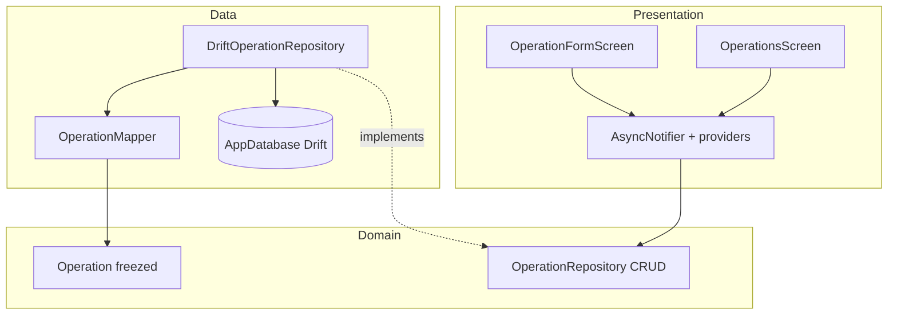

# CRUD: операции + Drift

Цель этапа — научиться **полному циклу данных**: список → создать → редактировать → удалить, с **локальной persistence**. UI остаётся учебным (не пиксель-перфект). Активы / цели / аналитика **не трогаем** (Assets остаются на mock).

Стек (зафиксирован): **Drift + SQLite**, **Operations**, расширение **repository pattern**, **Riverpod AsyncNotifier**, **go_router** для create/edit.

---

## 1. Что получится в конце CRUD

- Операции читаются/пишутся в локальную SQLite через Drift.
- Вкладка **Операции**: список из БД, empty state, pull-to-refresh (или авто-обновление после мутаций).
- **Создание** — маршрут `/operations/new` (или из «+» → «Операция»).
- **Редактирование** — `/operations/:id/edit`.
- **Удаление** — swipe / long-press + confirm dialog; запись исчезает из БД и списка.
- После kill/restart приложения данные **сохраняются**.
- Domain-сущность `Operation` по-прежнему freezed; UI не знает про Drift-таблицы.




---

## 2. Зависимости

В [pubspec.yaml](pubspec.yaml):


| Пакет                    | Зачем                                                   |
| ------------------------ | ------------------------------------------------------- |
| `drift`                  | ORM / type-safe SQL                                     |
| `drift_flutter`          | готовый `NativeDatabase.createInBackground` под Flutter |
| `sqlite3_flutter_libs`   | нативный SQLite на mobile/desktop                       |
| `path_provider` + `path` | путь к файлу БД (если не только через `drift_flutter`)  |
| `drift_dev` (dev)        | генерация `*.g.dart` из таблиц                          |
| `uuid`                   | генерация `id` при create (строковый id как сейчас)     |


Команда codegen (вместе с freezed):  
`dart run build_runner build --delete-conflicting-outputs`

**Учёба:** Drift генерирует typed queries из декларации таблиц. Domain **не** импортирует `package:drift` — только `data/`. Иначе слои склеятся и mock/API-замена станет болью.

---

## 3. Domain: расширить контракт

Файл: [lib/domain/repositories/operation_repository.dart](lib/domain/repositories/operation_repository.dart)

Сейчас только `getOperations()`. Расширить:

```dart
abstract class OperationRepository {
  Future<List<Operation>> getOperations();
  Future<Operation?> getOperation(String id);
  Future<void> createOperation(Operation operation);
  Future<void> updateOperation(Operation operation);
  Future<void> deleteOperation(String id);
}
```

Сущность [lib/domain/entities/operation.dart](lib/domain/entities/operation.dart) — оставить поля как есть (`id`, `type`, `amount`, `date`, `assetId?`, `description?`). На этапе CRUD `assetId` храним как nullable string **без FK на таблицу активов** (Assets ещё mock) — связь «настоящим» join отложим.

`MockOperationRepository` — либо удалить после подключения Drift, либо оставить как in-memory CRUD для тестов/учёбы (реализовать те же методы в `List`). Рекомендация этапа: **оставить mock с in-memory CRUD** и переключать в provider одной строкой — так видно ценность интерфейса.

**Учёба:** UI и Notifier зависят от абстракции. Best practice сегодня — thin repository: без бизнес-правил «можно ли удалить», только persistence. Валидация формы — в presentation (или отдельный use-case позже).

---

## 4. Data: Drift schema + mapper + repo

Новые файлы (ориентир):

```
lib/data/
  local/
    app_database.dart          # @DriftDatabase, open connection
    app_database.g.dart        # generated
    tables/operations_table.dart
  mappers/
    operation_mapper.dart      # Operation ↔ Data class / row
  repositories/
    drift_operation_repository.dart
    mock_operation_repository.dart  # обновить до полного CRUD
```

**Таблица `Operations` (примерно):**


| Колонка       | Тип Drift               | Domain          |
| ------------- | ----------------------- | --------------- |
| `id`          | `TextColumn` PK         | `String id`     |
| `type`        | `IntColumn` / text enum | `OperationType` |
| `amount`      | `IntColumn`             | `int amount`    |
| `date`        | `DateTimeColumn`        | `DateTime date` |
| `assetId`     | `TextColumn` nullable   | `String?`       |
| `description` | `TextColumn` nullable   | `String?`       |


На первом открытии — **seed** 2–3 операций (как текущий mock), если таблица пуста. Иначе после миграции список будет пустым и сложнее проверить read-path.

**Учёба:**

- **Mapper** — единственное место знания «как row → entity». Не тащить Drift row в UI.
- **Альтернативы Drift:** Hive (проще, без SQL), Isar, raw sqflite. Drift выбран за type-safety и задел под join с активами позже.
- Миграции: с версии 1 на старте достаточно `schemaVersion: 1`. При смене схемы — `MigrationStrategy.onUpgrade` (мини-задание после этапа).

Инициализация БД: `Provider` / `FutureProvider` на `AppDatabase`, закрытие через `ref.onDispose(db.close)`. В `main.dart` при необходимости дождаться открытия (как с `SharedPreferences`).

---

## 5. Riverpod: от FutureProvider к AsyncNotifier

Сейчас ([operations_providers.dart](lib/features/operations/presentation/operations_providers.dart)):

```dart
final operationsProvider = FutureProvider<List<Operation>>(...);
```

`FutureProvider` неудобен для мутаций (только `invalidate`). На CRUD-этапе:

```dart
final operationRepositoryProvider = Provider<OperationRepository>(
  (ref) => DriftOperationRepository(ref.watch(appDatabaseProvider)),
);

class OperationsNotifier extends AsyncNotifier<List<Operation>> {
  @override
  Future<List<Operation>> build() =>
      ref.watch(operationRepositoryProvider).getOperations();

  Future<void> create(Operation op) async { ... refresh ... }
  Future<void> update(Operation op) async { ... }
  Future<void> remove(String id) async { ... }
}

final operationsProvider =
    AsyncNotifierProvider<OperationsNotifier, List<Operation>>(
      OperationsNotifier.new,
    );
```

После create/update/delete: либо `state = AsyncData(await repo.getOperations())`, либо optimistic update + rollback on error.

Отдельный `operationProvider(id)` / `family` — для edit-экрана (`getOperation`).

**Учёба:** `AsyncNotifier` = список + команды в одном месте. Альтернатива — оставить `FutureProvider` + `ref.invalidate` после каждого write (проще, но меньше контроля над loading на кнопке Save). Для учёбы CRUD — Notifier предпочтительнее.

---

## 6. UI и маршруты

### Список — [operations_screen.dart](lib/features/operations/presentation/operations_screen.dart)

- `AsyncValue.when` как сейчас.
- Empty state + l10n-строка.
- Tap по строке → `context.push('/operations/${op.id}/edit')`.
- Удаление: `Dismissible` или иконка → `AlertDialog` confirm → `ref.read(operationsProvider.notifier).remove(id)`.
- FAB на экране **не обязателен** — создание через «+» и/или AppBar action.

### Форма — новый `operation_form_screen.dart`

Один экран на create и edit (параметр `String? id`):

- Поля: тип (SegmentedButton income/expense), amount (`TextFormField` + валидация > 0), date (`showDatePicker`), description (optional).
- `Form` + `GlobalKey<FormState>`.
- Save → create или update → `context.pop()`.
- Loading/error на кнопке сохранения.

### «+» sheet — [add_action_sheet.dart](lib/features/add_action/presentation/add_action_sheet.dart)

Один пункт «Операция» → `Navigator.pop` sheet → `context.push('/operations/new')`. Остальные пункты могут остаться заглушками.

### Router — [app_router.dart](lib/app/router/app_router.dart)

Добавить **вне shell** (как `/goals/:id`), чтобы был Back:


| Path                   | Экран                          |
| ---------------------- | ------------------------------ |
| `/operations/new`      | `OperationFormScreen` (create) |
| `/operations/:id/edit` | `OperationFormScreen` (edit)   |


**Учёба:** `push` для форм (стек + Back); `go` для табов. Не класть тяжёлую форму внутрь bottom sheet на первом проходе — отдельный route проще дебажить и тестировать.

---

## 7. Локализация

В ARB добавить ключи (минимум): `operationsEmpty`, `operationCreateTitle`, `operationEditTitle`, `operationSave`, `operationDelete`, `operationDeleteConfirm`, `operationAmount`, `operationTypeIncome`, `operationTypeExpense`, `operationDescription`, `addOperationAction`, ошибки валидации.

Строки ошибок списка — тоже через l10n (сейчас литерал в [operations_screen.dart](lib/features/operations/presentation/operations_screen.dart)).

---

## 8. Порядок практики (чеклист)

1. **pubspec** — drift / drift_flutter / sqlite3_flutter_libs / path / uuid + drift_dev.
2. **Таблица + AppDatabase** — codegen, открытие файла БД, provider.
3. **Mapper + DriftOperationRepository** — реализовать 5 методов; seed при пустой таблице.
4. **Расширить domain repo + mock** — тот же контракт.
5. **Переключить** `operationRepositoryProvider` на Drift.
6. **OperationsNotifier** — заменить `FutureProvider`.
7. **Форма + маршруты** create/edit.
8. **Удаление** с confirm.
9. **Add sheet** → create route.
10. **Проверка** — создать / править / удалить / hot restart → данные на месте; переключение mock↔drift одной строкой в provider.

Критерий готовности CRUD: полный цикл операций переживает restart; domain/UI не импортируют Drift; Assets по-прежнему mock.

---

## 9. Учебные мини-задания (после CRUD)

- Добавить `schemaVersion: 2` и колонку (например `category`) + `onUpgrade`.
- Фильтр списка: только income / только expense (query в Drift, не `where` в UI по всему списку — сравнить оба подхода).
- Намеренно вызвать `update` с несуществующим id — увидеть, где ловить ошибку (repo vs notifier vs UI).
- Подключить `assetId` как FK, когда появится таблица Assets.

---

## 10. Что сознательно НЕ входит

- CRUD активов / целей / счетов
- Пиксель-перфект UI, графики Analytics
- Синхронизация / API / auth
- Сложные миграции, multi-isolate tuning
- Offline-first conflict resolution

Следующие этапы (ориентир): UI Home по концепту → Assets CRUD/Drift → Analytics → richer Add flows.

---

## 11. Ключевые файлы этапа

- [lib/domain/repositories/operation_repository.dart](lib/domain/repositories/operation_repository.dart) — CRUD-контракт
- [lib/data/local/app_database.dart](lib/data/local/app_database.dart) — Drift DB
- [lib/data/repositories/drift_operation_repository.dart](lib/data/repositories/drift_operation_repository.dart)
- [lib/data/mappers/operation_mapper.dart](lib/data/mappers/operation_mapper.dart)
- [lib/features/operations/presentation/operations_providers.dart](lib/features/operations/presentation/operations_providers.dart) — AsyncNotifier
- [lib/features/operations/presentation/operation_form_screen.dart](lib/features/operations/presentation/operation_form_screen.dart) — новый
- [lib/app/router/app_router.dart](lib/app/router/app_router.dart) — new/edit routes
- [lib/features/add_action/presentation/add_action_sheet.dart](lib/features/add_action/presentation/add_action_sheet.dart) — пункт «Операция»

