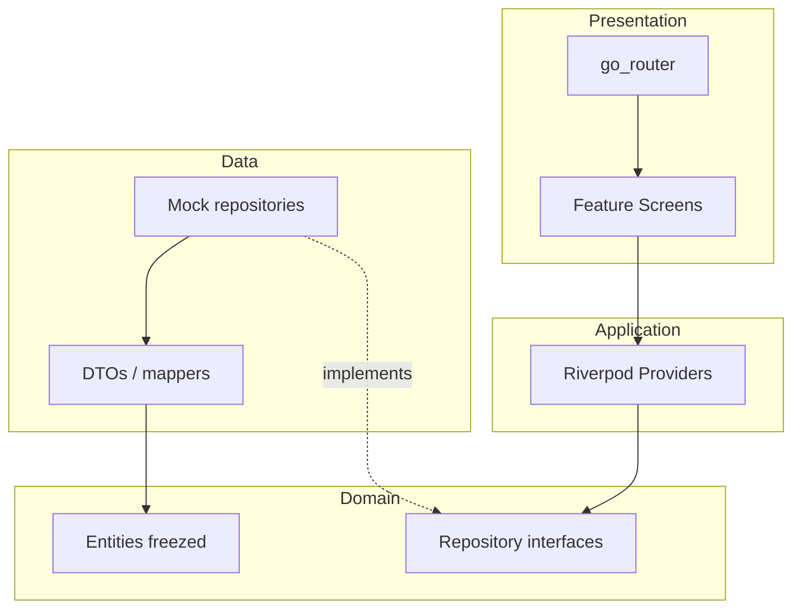

# Foundation: каркас финансового приложения

Цель этапа — не сверстать все экраны, а получить **живой скелет**: тема, навигация с bottom bar и «+», локализация, слои domain/data, пустые feature-экраны. Данные — mock-репозитории. UI макета подключаем на следующих этапах.

Стек (зафиксирован): **Riverpod + go_router + freezed**, **feature-first**, **domain отдельно**, **repository pattern**, **light/dark theme**.

---

## 1. Что получится в конце Foundation

Приложение стартует с тёмной/светлой темой (переключатель).

- Bottom navigation: Главная / Активы / **+** / Операции / Аналитика.
- «+» открывает модальный bottom sheet (сетка действий-заглушек).
- Переход на детальный экран-заглушку (например Goal detail) через `go_router`.
- Строки на русском через ARB + `intl`.
- Пример сущности `Asset` через freezed + mock `AssetRepository` + Riverpod provider.
- Чистый `main.dart` (~20 строк), без учебных экспериментов.




---

## 2. Структура папок (feature-first + clean layers)

```
lib/
  main.dart
  app/
    app.dart                 # MaterialApp.router + ProviderScope
    router.dart              # GoRouter, ShellRoute, routes
    theme/
      app_theme.dart
      app_colors.dart        # токены light/dark
      app_typography.dart
  core/
    l10n/                    # generated + helpers
    extensions/              # money, date formatting
    widgets/                 # общие: AppScaffold, section card shell
  domain/
    entities/
      asset.dart             # freezed
      account.dart
      goal.dart
      operation.dart
    repositories/
      asset_repository.dart  # abstract
      ...
  data/
    models/                  # JSON DTO при необходимости
    mappers/
    repositories/
      mock_asset_repository.dart
  features/
    home/
      presentation/home_screen.dart
    assets/
      presentation/assets_screen.dart
    operations/
      presentation/operations_screen.dart
    analytics/
      presentation/analytics_screen.dart
    add_action/
      presentation/add_action_sheet.dart
    goal_detail/
      presentation/goal_detail_screen.dart
    shell/
      presentation/main_shell.dart   # bottom nav + Outlet
```

**Учёба:** feature-first = код экрана рядом с его UI; domain не знает про Flutter/Riverpod; data реализует контракты domain. Так проще масштабировать (новый экран = новая папка в `features/`).

---

## 3. Зависимости

В [pubspec.yaml](pubspec.yaml):


| Пакет                                         | Зачем                                  |
| --------------------------------------------- | -------------------------------------- |
| `flutter_riverpod`                            | DI + реактивное состояние              |
| `go_router`                                   | декларативные маршруты, ShellRoute     |
| `freezed_annotation` + `freezed` (dev)        | immutable entities, `copyWith`, unions |
| `json_annotation` + `json_serializable` (dev) | сериализация (задел под API)           |
| `build_runner` (dev)                          | генерация freezed/json                 |
| `flutter_localizations` (sdk) + `intl`        | RU локаль, форматы чисел/дат           |
| `google_fonts` или локальный шрифт            | типографика ближе к макету             |


Убрать из учебного `main` вызов `http` к teleads; `http` оставить в pubspec как задел под реальный API позже. Для macOS — entitlement `com.apple.security.network.client` (уже обсуждали).

**Учёба:** `build_runner` генерирует `*.freezed.dart` / `*.g.dart` — их не правят руками. Команда: `dart run build_runner build --delete-conflicting-outputs`.

---

## 4. Тема light / dark

Из макета вынести токены (примерно):

- Background: тёмный navy (`#0D1117`-подобное) / светлый surface
- Card surface чуть светлее фона
- Semantic: green (рост), red (падение), blue (CTA), gold (металлы)
- Радиусы карточек ~16–24

Реализация:

- `AppColors` — две палитры (`light` / `dark`)
- `ThemeData` через `ColorScheme.fromSeed` + ручные overrides для cards, bottom nav, app bar
- `ThemeMode` в Riverpod (`themeModeProvider`), переключатель на Home (иконка) для проверки

**Учёба:** не хардкодить `Colors.green` в виджетах — брать `Theme.of(context).colorScheme` или свои extension (`context.colors.profit`). Иначе light/dark разъедутся.

---

## 5. Навигация (go_router)

Маршруты:


| Path                                            | Экран                                                         |
| ----------------------------------------------- | ------------------------------------------------------------- |
| `/`                                             | redirect → `/home`                                            |
| `/home`, `/assets`, `/operations`, `/analytics` | shell tabs                                                    |
| `/goals/:id`                                    | detail поверх shell или вне shell                             |
| модалка «+»                                     | не route, а `showModalBottomSheet` из shell (проще для учёбы) |


`StatefulShellRoute.indexedStack` — сохраняет состояние вкладок при переключении (как IndexedStack, но через go_router).

`MainShell`: кастомный bottom bar с центральной кнопкой «+» (выступающая FAB-подобная), 4 обычных пункта.

**Учёба:**

- `context.go` — заменить стек (табы)
- `context.push` — детали с Back
- Shell = общий chrome (nav bar), child = текущая ветка
- Deep link `/goals/1` должен открывать detail даже «с холодного старта»

---

## 6. Локализация

- ARB: `lib/l10n/app_ru.arb` (основной), опционально `app_en.arb` для упражнения
- Ключи: `navHome`, `navAssets`, `navOperations`, `navAnalytics`, `addActionTitle`, `familyCapital`, …
- `MaterialApp.router(localizationsDelegates: …, supportedLocales: [Locale('ru')], locale: Locale('ru'))`
- Форматирование денег: helper `formatMoney(int kopecksOrRubles)` с пробелами тысяч и `₽` через `intl` NumberFormat

**Учёба:** строки не в UI-литералах; для plurals/gender — ICU в ARB. После смены ARB — `flutter gen-l10n` (или авто при build).

---

## 7. Domain + freezed + repository

Минимальный набор сущностей для Foundation (поля по макету, без полной бизнес-логики):

- `Asset` — id, name, type (stock/metal/currency/cash), value, changePercent
- `Account` — bank name, balance
- `Goal` — title, target, current, progress
- `Operation` — title, amount, date, kind (income/expense)

```dart
// domain/repositories/asset_repository.dart
abstract class AssetRepository {
  Future<List<Asset>> getAssets();
}
```

```dart
// data/repositories/mock_asset_repository.dart
class MockAssetRepository implements AssetRepository { ... }
```

Riverpod:

```dart
final assetRepositoryProvider = Provider<AssetRepository>(
  (ref) => MockAssetRepository(),
);

final assetsProvider = FutureProvider<List<Asset>>((ref) {
  return ref.watch(assetRepositoryProvider).getAssets();
});
```

На `AssetsScreen` — простой `AsyncValue.when` (loading / error / list tiles-заглушки). Это доказывает связку domain → data → UI.

**Учёба:** UI зависит от `Asset` (domain), не от JSON. Замена mock на API = новый класс `ApiAssetRepository` + смена provider, экраны не трогаем.

---

## 8. Порядок практики (чеклист)

1. **Cleanup** — вычистить учебный `main.dart`, оставить точку входа.
2. **pubspec** — зависимости + `generate: true` / l10n config в `flutter:` section.
3. **Папки** — создать дерево `app/`, `core/`, `domain/`, `data/`, `features/`.
4. **Тема** — colors + ThemeData light/dark + `themeModeProvider`.
5. **L10n** — ARB, gen-l10n, подключить в App.
6. **Shell + go_router** — 4 вкладки-заглушки + центральный «+» sheet.
7. **freezed entity + mock repo + provider** — показать список на Assets.
8. **Один push-route** — Goal detail по `/goals/:id` с параметром.
9. **Проверка** — hot restart, смена темы, переключение табов, открытие «+» и detail.

Критерий готовности Foundation: можно открыть все 4 вкладки, «+», detail, сменить тему, увидеть mock-активы из Riverpod — без пиксель-перфект UI.

---

## 9. Учебные мини-задания (после каркаса)

- Добавить `Operation` + mock repo и заглушку списка на Operations (повторить паттерн).
- Добавить второй `ThemeMode` persistence через `shared_preferences` (опционально, уже за гранью строгого Foundation).
- Намеренно сломать mapper (неверный тип) и посмотреть, где падает слой data vs domain.

---

## 10. Что сознательно НЕ входит в Foundation

- Графики (fl_chart и т.п.), пиксель-перфект карточки макета
- Реальный API / auth
- Полная CRUD логика целей и операций
- Codegen сверх freezed/json/l10n

Это следующие этапы: UI Home → Assets → Operations → Analytics → Add flows.

---

## 11. Ключевые файлы, которые появятся первыми

- [lib/main.dart](lib/main.dart) — `ProviderScope` + `FinanceApp`
- [lib/app/app.dart](lib/app/app.dart) — `MaterialApp.router`
- [lib/app/router.dart](lib/app/router.dart) — маршруты
- [lib/app/theme/app_theme.dart](lib/app/theme/app_theme.dart)
- [lib/features/shell/presentation/main_shell.dart](lib/features/shell/presentation/main_shell.dart)
- [lib/domain/entities/asset.dart](lib/domain/entities/asset.dart)
- [lib/domain/repositories/asset_repository.dart](lib/domain/repositories/asset_repository.dart)
- [lib/data/repositories/mock_asset_repository.dart](lib/data/repositories/mock_asset_repository.dart)

