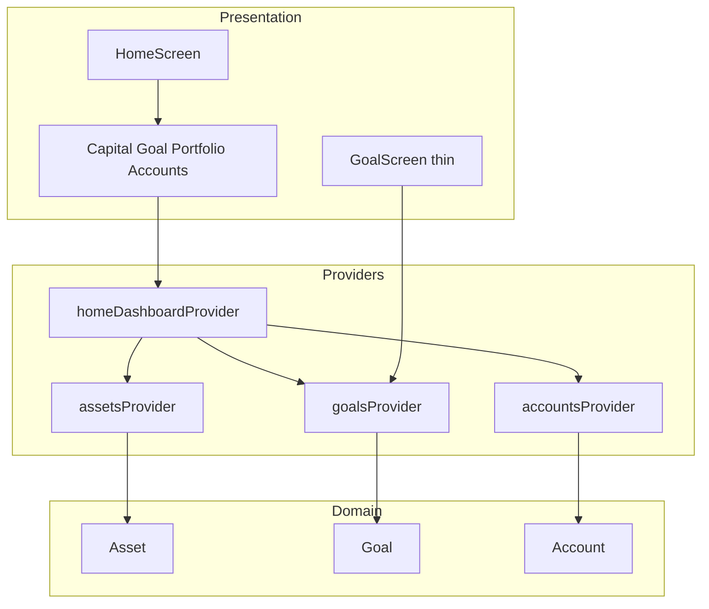

# UI Home по концепту

Цель этапа — превратить заглушку [`lib/features/home/presentation/home_screen.dart`](lib/features/home/presentation/home_screen.dart) в **дашборд**: приветствие, семейный капитал, карточка цели, распределение портфеля, сетка счетов. Ориентир — [`.cursor/app-concept.png`](.cursor/app-concept.png), не пиксель-перфект.

Стек тот же: **Riverpod + go_router + freezed + l10n + `AppColors`**. Новые сущности **Goal** и **Account** — mock-репозитории (как Assets). Operations/Drift **не трогаем**. `fl_chart` не подключаем — кольцо/донат через `CustomPaint`.

Связь с Foundation: каркас (тема, shell, l10n, слои) уже есть. Недоделанное из Foundation, которое закрываем здесь: сущности Goal/Account, UI Home, общий виджет карточки секции. Не закрываем: Analytics, Add-сетка 3×3, типографика google_fonts.



---

## 1. Что получится в конце этапа

- Главная — вертикальный скролл секций по концепту (не одна кнопка «к цели»).
- **Семейный капитал** = сумма `Asset.value` из уже существующего mock.
- Карточка **цели** с прогрессом (кольцо CustomPaint) → `context.push('/goals/:id')`.
- **Распределение портфеля** — доли по `AssetType` + простой donut.
- Сетка **счетов** 2×2 из mock `Account`.
- Экран цели перестаёт быть текстом «Тут будеть целя»: показывает title / target / current / progress из той же сущности.
- Light/dark через существующие токены `context.colors`; строки — ARB.

Критерий готовности: на Home видны все 4 блока с данными из провайдеров; тап по цели открывает `/goals/:id` с теми же цифрами; тема не ломает контраст; Operations CRUD как был.

---

## 2. Domain: Goal и Account (долг Foundation)

Сейчас есть только [`Asset`](lib/domain/entities/asset.dart) и `Operation`. Для дашборда нужны две сущности (поля — учебный минимум, без бизнес-правил):

**Goal** — `lib/domain/entities/goal.dart`:

- `id`, `title`, `target` (num), `current` (num)
- progress считать геттером: `current / target` (clamp 0..1), не хранить отдельным полем — иначе данные разъедутся

**Account** — `lib/domain/entities/account.dart`:

- `id`, `bankName`, `balance` (num), `changePercent` (double)

Репозитории (read-only, как Assets на Foundation):

```dart
abstract class GoalRepository {
  Future<List<Goal>> getGoals();
  Future<Goal?> getGoal(String id);
}

abstract class AccountRepository {
  Future<List<Account>> getAccounts();
}
```

Mock: 1 цель («Квартира») и 4 банка — цифры порядка концепта, не обязательно совпадающие с суммой активов.

**Источник правды для капитала:** сумма **активов**, не счетов. На концепте 10.8M совпадает с «Активами», а сетка банков даёт другую сумму — это нормально для учебы. На Home явно: капитал ← assets, портфель ← группировка assets, счета ← accounts.

**Учёба:** UI зависит от domain, не от «цифр в виджете». Замена mock на Drift позже = новый класс + смена provider. Progress в entity/getter, не `73` захардкоженный в CustomPaint.

Альтернатива «всё захардкодить в Home» — быстрее сверстать, но ломает смысл слоёв, которые уже есть.

---

## 3. Dashboard provider: композиция, не бог-виджет

Не складывать `ref.watch(assets)` + `ref.watch(goals)` + `ref.watch(accounts)` прямо в `HomeScreen` с тремя вложенными `.when` — получится ад loading/error.

Паттерн этапа — один агрегат:

```dart
@freezed
abstract class HomeDashboard with _$HomeDashboard {
  const factory HomeDashboard({
    required double familyCapital,
    required double capitalChangePercent, // взвешенно или просто заглушка
    required Goal? primaryGoal,
    required List<PortfolioSlice> portfolio,
    required List<Account> accounts,
  }) = _HomeDashboard;
}
```

`homeDashboardProvider` = `FutureProvider`, который `await` три репо (или `ref.watch` существующих `assetsProvider` + новых). Слайсы портфеля: `groupBy AssetType`, доля = typeSum / capital.

**Учёба:** дашборд — orchestration layer. Виджеты получают уже готовые числа. Альтернативы: три независимых `.when` (проще, хуже UX); `Notifier` (избыточно, мутаций нет). Best practice для read-only dashboard — один async snapshot / family.

`assetsProvider` не дублировать логикой — Home **читает** его, не копирует mock.

---

## 4. UI Главной: секции, не один файл-простыня

Разбить [`home_screen.dart`](lib/features/home/presentation/home_screen.dart) на виджеты в `lib/features/home/presentation/widgets/`:

- `home_header.dart` — greeting (l10n) + переключатель темы (уже есть); колокол можно иконкой-заглушкой
- `capital_card.dart` — подпись `familyCapital`, сумма через [`formatMoney`](lib/core/format/money_format.dart), процент через [`formatSignedPercent`](lib/core/format/format_signed_percent.dart). Sparkline **не обязателен** (нет time-series)
- `goal_card.dart` — кольцо + title + накоплено/осталось; `onTap` → `context.push('/goals/${goal.id}')`
- `portfolio_card.dart` — donut + легенда (Металлы / Акции / Валюта / Кэш)
- `accounts_grid.dart` — 2 колонки, тап опционально `context.go('/assets')` («Смотреть все»)

`HomeScreen`: `CustomScrollView` + `SliverList` / обычный `ListView`, `SafeArea`, `AsyncValue.when` на `homeDashboardProvider`.

Общая оболочка карточки — [`lib/core/widgets/app_section_card.dart`](lib/core/widgets/app_section_card.dart): surface, радиус 20 (как `cardTheme`), padding. **Учёба:** общее в `core/widgets`, фичевое — в `features/home`. Не тащить GoalCard в core.

Цвета секторов: `profit` / `metal` / `primary` / `onSurface.withValues(alpha: …)` — без новых `Colors.orange` в обход темы.

Кольцо и donut: один простой `CustomPainter` (sweep `drawArc`). Без `fl_chart` — его логичнее оставить этапу Analytics. Альтернатива `CustomPaint`: цветной `CircularProgressIndicator` — быстрее, меньше контроля над легендой.

Сознательно **не** в этом этапе (мини-задания после):

- «Цель месяца» и баннер «осталось внести сегодня»
- Sparkline капитала
- Вкладки цели Обзор/История/План и кнопка «Внести деньги»

---

## 5. Goal screen — тонкий, не полный макет

[`lib/features/goal/presentation/goal_screen.dart`](lib/features/goal/presentation/goal_screen.dart): `ref.watch(goalProvider(id))`, AppBar = title, те же цифры и кольцо (можно переиспользовать painter). Маршрут `/goals/:id` уже есть в [`app_router.dart`](lib/app/router/app_router.dart).

Не делать CRUD цели и не подключать Drift.

---

## 6. Локализация

В [`lib/l10n/app_ru.arb`](lib/l10n/app_ru.arb) (+ en): `homeUpdatedToday`, `allAccounts`, `seeAll`, `goalProgress`, `goalSaved`, `goalLeft`, `portfolioDistribution`, `assetTypeStock/Metal/Currency/Cash`, `accountsSection`, плюс ошибки загрузки Home.

Убрать литерал `'К цели номер 1'`. Greeting уже есть.

---

## 7. Порядок практики (чеклист)

1. **Goal + Account** freezed + codegen.
2. **Интерфейсы + mock** репозитории + providers (`goalsProvider`, `goalProvider(id)`, `accountsProvider`) — по образцу [`assets_providers.dart`](lib/features/assets/presentation/assets_providers.dart).
3. **HomeDashboard** + `homeDashboardProvider` (капитал, слайсы, primary goal).
4. **`AppSectionCard`** в core.
5. **Секции Home** по одной: header → capital → goal → portfolio → accounts. После каждой — hot restart и смена темы.
6. **GoalScreen** читает `goalProvider(id)`.
7. **l10n** ключи, `flutter gen-l10n`.
8. **Проверка:** данные на Home; тап цели = тот же progress; Assets/Operations не сломаны.

---

## 8. Учебные мини-задания (после Home)

- Взвешенный `changePercent` капитала vs «взять у первого актива» — увидеть, зачем агрегация в provider.
- Намеренно сделать `target == 0` у цели — где ловить division by zero (getter vs UI).
- Sparkline: список точек в mock vs «рисовалка без данных».
- Вынести `PortfolioSlice` в domain vs оставить view-model фичи Home — сравнить связность.

---

## 9. Что сознательно НЕ входит

- Пиксель-перфект, Figma, `google_fonts`
- `fl_chart`, история котировок, Analytics
- CRUD/Drift для Goal и Account (это ближе к этапу Assets)
- Сетка «+» 3×3, деталка Сбербанка, фильтры Assets
- Си Horизация капитала и банковских балансов «чтобы сошлось как на картинке»

Следующий этап после Home (ориентир): **Assets UI/CRUD + Drift** → Analytics → richer Add.

---

## 10. Ключевые файлы

- [`lib/domain/entities/goal.dart`](lib/domain/entities/goal.dart), [`lib/domain/entities/account.dart`](lib/domain/entities/account.dart) — новые
- [`lib/domain/repositories/goal_repository.dart`](lib/domain/repositories/goal_repository.dart), `account_repository.dart`
- [`lib/data/repositories/mock_goal_repository.dart`](lib/data/repositories/mock_goal_repository.dart), `mock_account_repository.dart`
- [`lib/features/home/presentation/home_providers.dart`](lib/features/home/presentation/home_providers.dart) — dashboard
- [`lib/features/home/presentation/home_screen.dart`](lib/features/home/presentation/home_screen.dart) + `widgets/`
- [`lib/core/widgets/app_section_card.dart`](lib/core/widgets/app_section_card.dart)
- [`lib/features/goal/presentation/goal_screen.dart`](lib/features/goal/presentation/goal_screen.dart)
- [`lib/l10n/app_ru.arb`](lib/l10n/app_ru.arb)
